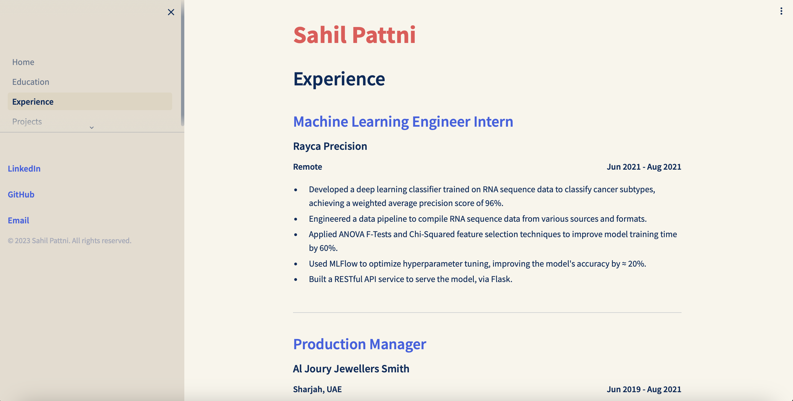
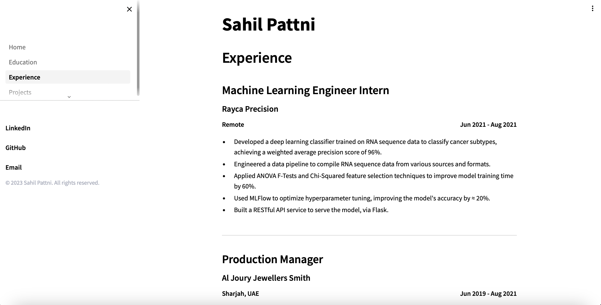

# Streamlit Personal Website Template

minimal theme

    
    

This is a minimalistic template for creating your own personal website using [Streamlit](https://streamlit.io/). No other dependencies are needed. You can see a live demo of the template [here](https://sahilpattni.streamlit.app).

## How to Use
The content is managed via the YAML files in the `resources` directory. Replace these with your own content, and add/remove YAML files as needed. 
The YAML files in each section are read in and rendered in order of their `rank` attribute.

You'll find several themes in the `config.toml` file. You can switch themes by keeping the one you want uncommented.